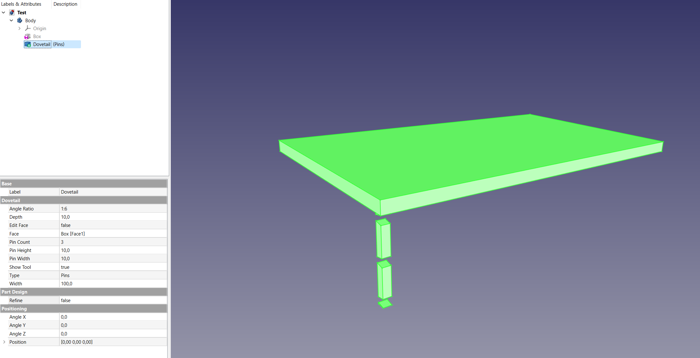
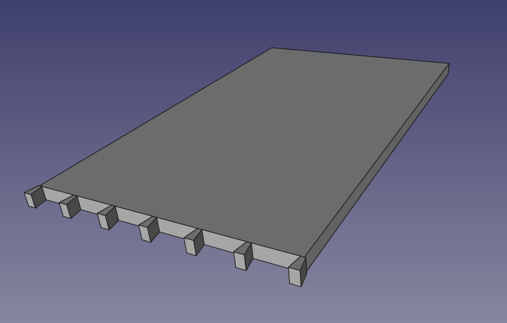
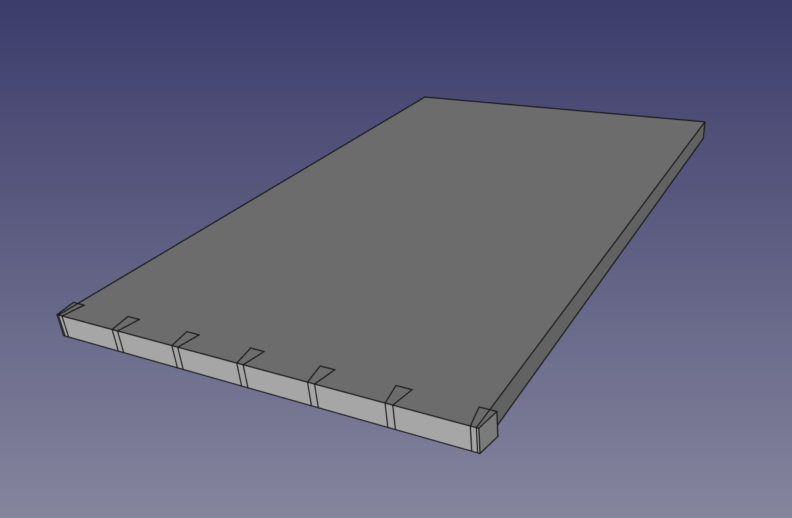

# FreeCAD Dovetail Joint
This is a macro for woodworkers using FreeCAD. It creates a dovetail joint to join two boards.

It is mostly based on [mwganson's joint macro](https://github.com/mwganson/joint) which is a great tool, but somewhat hard to use for dovetails.

## Installation
Install it by placing the `zsDovetail.FCMacro` into your macro folder. On first run it will offer to create a new file called `zsDovetail.py`. This file is needed for the zsDovetail feature python objects to be parametric and functional upon reloading documents containing these objects.

## Usage
In this example we want to join two boards of 300 mm width, 16 mm thick. We start with the pins on the first board. Select the face of the board which should get the pins:

Now run the macro `zsDovetail.FCMacro`. A default dovetail joint with editable properties will appear in the tree:

Note that the `Show Tool` property is set to `true` by default. It shows the tool which will be used to cut out the waste between the pins (as in real making the pins on a board). This helps to position the tool. Adjust the parameters as needed. In our example, we first rotate the dovetail by 90 degrees on the Z-axis. Then we set the `Depth` and the `Pin Height` to the material thickness, which is 16 mm. The `Width` is set to the width of the board (300 mm). Set the `Pin Count` to 7. Now we have this result:

Remember the `Show Tool` property is still set to `true`, it shows the cutout which will be made. Setting it to `false` now gives us the pins:

According to the woodworking rules, a pin board should have half pins at either end, so let's do that. We set the `Width` property 8 mm wider than the board (308 mm) and offset the `Position y` to -4 mm. Now we are done with the pin board:

Now the tails board: We start the same way by selecting the face of the board:

Run the macro `zsDovetail.FCMacro` and set all parameters to the exact same values as the pin board, leave `Show Tool` set to `true`. Then just flip the `Type` parameter to `Tails` and you get this result:

Remember `Show Tool` shows us the cutout tool. We need to rotate 180 degrees around the X-axis and shift the `Position x` by -16 mm (material thickness). The tool should now look like this:

Set `Show Tool` to `false` and we have our tailboard ready:

You can now join the two boards with the positioning/assembly of your choice:

For half-blind dovetails, just set the thickness of the pin board to 20 mm:

